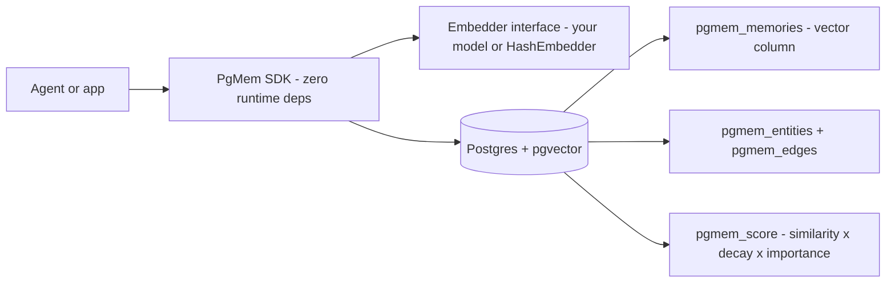

# pgmem

[English](README.md) | [中文](README.zh.md) | [日本語](README.ja.md)

 [](LICENSE) [](CHANGELOG.md) [](https://github.com/JaydenCJ/pgmem/discussions)

**オープンソースの agent メモリエンジン。純粋な Postgres だけで vector 検索・knowledge graph・時間減衰ランキングを提供し、追加インフラを必要としません。**


```bash
npm install pgmem @electric-sql/pglite @electric-sql/pglite-pgvector
```

## なぜ pgmem なのか

agent の長期メモリは現状、SaaS に預けるか妥協するかの二択になっています。Mem0 のオープンソース版がカバーするのは vector 層のみで、graph メモリは有料プランに含まれます。Zep のプラットフォームは完全にオープンソースなセルフホストを提供しなくなりました（抽出ライブラリの Graphiti のみオープンソースのままです）。Letta は別途運用が必要な server です。データ主権の制約を受けるチーム——EU AI Act 対応、日本の金融・医療業界——にとって、agent のメモリが自社のデータベースの外へ出る構成は選択肢になりません。pgmem はこのスタックを逆転させます。すでに運用中の Postgres そのものがメモリエンジンになり、類似度は pgvector、knowledge graph は通常のテーブル、時間減衰ランキングは監査可能な 2 つの SQL 関数が担います。

|  | pgmem | Mem0 | Zep |
|---|---|---|---|
| Graph メモリ | MIT, included | Paid tier | Graphiti library + separate graph DB |
| 完全オープンソースのセルフホスト | Yes — any Postgres with pgvector | Vector layer only | Platform is SaaS (from ~$25/mo) |
| 追加インフラ | None | Vector store + LLM provider | Graph DB (e.g. Neo4j) |
| 書き込み経路の LLM 呼び出し | None (deterministic) | Yes (fact extraction) | Yes (entity extraction) |

## 特徴

- **追加インフラゼロ** — 運用中の Postgres がメモリ層のすべてになり、新たにデプロイ・運用・課金する対象がありません。
- **ペイウォールのない graph メモリ** — エンティティ、型と重み付きのエッジ、N ホップのサブグラフ取得まで、すべて MIT で使えます。
- **時間を考慮した検索** — `pgmem_score` が cosine 類似度 x 指数的な時間減衰 x 重要度でランキングし、半減期はクエリごとに指定できます。
- **embedding は注入式** — メンバー 2 つの `Embedder` インターフェースのみで、モデルの同梱もダウンロードもありません。テストとデモ用に決定的な `HashEmbedder` を同梱しています。
- **ランタイム依存ゼロ** — SDK は構造的な `query()` インターフェースで `pg` にも PGlite にも接続でき、展開後 70 kB 未満です。
- **マルチ agent の namespace** — メモリ・エンティティ・エッジは 1 つのデータベース内で namespace ごとに分離されます。

## クイックスタート

インストールします（下の PGlite パッケージ 2 つはゼロ設定デモ用です。サーバー版 Postgres に接続する場合は `pgmem` と `pg` だけで済みます）:

```bash
npm install pgmem @electric-sql/pglite @electric-sql/pglite-pgvector
```

`quickstart.mts` として保存します。pgvector 付きの本物の Postgres がプロセス内でそのまま動きます:

```ts
import { PGlite } from "@electric-sql/pglite";
import { vector } from "@electric-sql/pglite-pgvector";
import { HashEmbedder, PgMem } from "pgmem";

const mem = new PgMem(new PGlite({ extensions: { vector } }), { embedder: new HashEmbedder(256) });
await mem.migrate();
await mem.add("Mika prefers oat-milk lattes in the morning", { entities: [{ name: "Mika", kind: "person" }] });
await mem.add("The deploy pipeline runs on port 8443 behind nginx");
const [top] = await mem.search("what does Mika drink in the morning?");
console.log(top?.content, `(score ${top?.score.toFixed(3)})`);
```

実行します（Node 22+ は TypeScript を直接実行できます）:

```bash
node quickstart.mts
```

出力:

```text
Mika prefers oat-milk lattes in the morning (score 0.471)
```

### サーバー版 Postgres で動かす

```bash
cp .env.example .env   # set a strong POSTGRES_PASSWORD first
docker compose up -d   # pgvector/pgvector:pg16, bound to 127.0.0.1
```

```ts
import pg from "pg";
import { HashEmbedder, PgMem } from "pgmem";

const pool = new pg.Pool({ connectionString: process.env.DATABASE_URL });
const mem = new PgMem(pool, { embedder: new HashEmbedder(256) });
await mem.migrate();
```

生の SQL を使う場合、schema とランキング関数は通常のファイルです。vector の次元を調整してから実行してください:

```bash
psql "$DATABASE_URL" -f sql/001_schema.sql -f sql/002_functions.sql
```

### 自前の embedder を接続する

pgmem はモデルを同梱せず、ダウンロードもせず、自身からネットワークへアクセスすることもありません。任意の embeddings API やローカルモデルを数行で `Embedder` にできます（例示用のコードのため、認証情報は各自で用意してください）:

```ts
import type { Embedder } from "pgmem";

export const apiEmbedder: Embedder = {
  dimensions: 1536,
  async embed(texts) {
    const res = await fetch(`${process.env.OPENAI_BASE_URL ?? "https://api.openai.com/v1"}/embeddings`, {
      method: "POST",
      headers: { "content-type": "application/json", authorization: `Bearer ${process.env.OPENAI_API_KEY}` },
      body: JSON.stringify({ model: "text-embedding-3-small", input: texts }),
    });
    if (!res.ok) throw new Error(`embeddings API returned ${res.status}`);
    const json = (await res.json()) as { data: Array<{ embedding: number[] }> };
    return json.data.map((d) => d.embedding);
  },
};
```

## アーキテクチャ



検索は 2 段階で行われます。まず pgvector の HNSW インデックスが `limit x oversample` 件の近傍候補に絞り込み、次に SQL 関数 `pgmem_score` が `similarity x 2^(-age / half_life) x importance` で再ランキングします。`search()` が返したメモリは `last_accessed_at` が更新されるため、よく使われる知識は `decay()` の削除を生き残り、使われない情報は徐々に消えていきます。強化と忘却が SQL 文 2 つで完結します。動作環境は Postgres 14+ と pgvector 0.5+ で、SDK は `query(sql, params)` を持つ任意のクライアント（`pg`、PGlite など）に対応しています。

## ロードマップ

- [x] v0.1.0 — 純粋な Postgres 内での vector + graph + 時間減衰、依存ゼロの TypeScript SDK
- [ ] ハイブリッド検索: `tsvector` キーワード検索と vector ランキングの併用
- [ ] バッチ `add()` と一括インポートのヘルパー
- [ ] Mem0・Zep に対する再現可能な recall/latency ベンチマーク
- [ ] 同一 schema と SQL 関数を共有する Python SDK

全体は [open issues](https://github.com/JaydenCJ/pgmem/issues) を参照してください。

## コントリビューション

コントリビューションを歓迎します。まず [CONTRIBUTING.md](CONTRIBUTING.md) を読み、[good first issue](https://github.com/JaydenCJ/pgmem/issues?q=is%3Aissue+is%3Aopen+label%3A%22good+first+issue%22) から着手するか、[Discussions](https://github.com/JaydenCJ/pgmem/discussions) でお気軽にどうぞ。

## ライセンス

[MIT](LICENSE)
