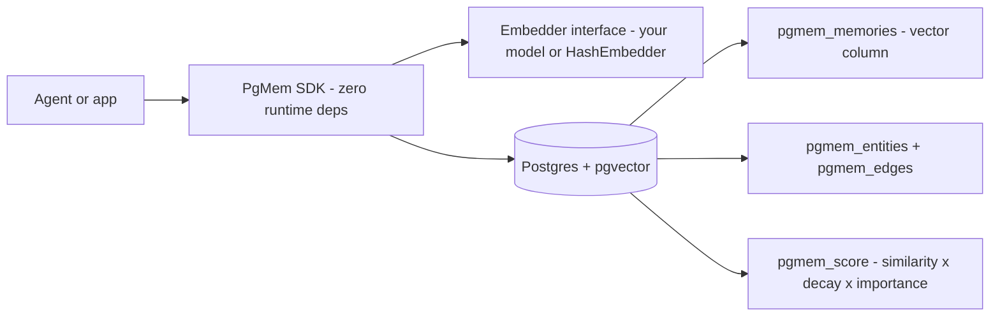

# pgmem

[English](README.md) | [中文](README.zh.md) | [日本語](README.ja.md)

 [](LICENSE) [](CHANGELOG.md) [](https://github.com/JaydenCJ/pgmem/discussions)

**Open-source agent memory in pure Postgres: vectors, knowledge graph, and temporal decay — no extra infrastructure.**



```bash
npm install pgmem @electric-sql/pglite @electric-sql/pglite-pgvector
```

## Why pgmem?

Long-term memory for agents today means either a SaaS or a compromise: Mem0's open-source edition covers the vector layer while graph memory sits in the paid tier; Zep no longer offers its platform as fully open-source self-hosting (only Graphiti, its extraction library, remains open); Letta is a separate server you have to operate. For teams under data-sovereignty constraints — EU AI Act deployments, finance and healthcare in Japan — agent memory that leaves your own database is a non-starter. pgmem inverts the stack: the Postgres you already run **is** the memory engine, with pgvector for similarity, plain tables for the knowledge graph, and two auditable SQL functions for time-decayed ranking.

|  | pgmem | Mem0 | Zep |
|---|---|---|---|
| Graph memory | MIT, included | Paid tier | Graphiti library + separate graph DB |
| Fully open-source self-host | Yes — any Postgres with pgvector | Vector layer only | Platform is SaaS (from ~$25/mo) |
| Extra infrastructure | None | Vector store + LLM provider | Graph DB (e.g. Neo4j) |
| LLM calls in the write path | None (deterministic) | Yes (fact extraction) | Yes (entity extraction) |

## Features

- **Zero new infrastructure** — the Postgres you already run is the whole memory layer; nothing else to deploy, operate, or pay for.
- **Graph memory without a paywall** — entities, typed weighted edges, and N-hop subgraph retrieval, all under MIT.
- **Time-aware retrieval** — `pgmem_score` ranks by cosine similarity x exponential recency decay x importance; the half-life is a per-query parameter.
- **Bring your own embeddings** — a two-member `Embedder` interface, no bundled models, no downloads; a deterministic `HashEmbedder` ships for tests and demos.
- **Zero runtime dependencies** — the SDK talks to `pg` or PGlite through a structural `query()` interface and is under 70 kB unpacked.
- **Multi-agent namespaces** — memories, entities, and edges are isolated per namespace inside one database.

## Quickstart

Install (the two PGlite packages power the zero-setup demo below; against a server Postgres you only need `pgmem` and `pg`):

```bash
npm install pgmem @electric-sql/pglite @electric-sql/pglite-pgvector
```

Save as `quickstart.mts` — a real Postgres with pgvector runs inside your process:

```ts
import { PGlite } from "@electric-sql/pglite";
import { vector } from "@electric-sql/pglite-pgvector";
import { HashEmbedder, PgMem } from "pgmem";

const mem = new PgMem(new PGlite({ extensions: { vector } }), { embedder: new HashEmbedder(256) });
await mem.migrate();
await mem.add("Mika prefers oat-milk lattes in the morning", { entities: [{ name: "Mika", kind: "person" }] });
await mem.add("The deploy pipeline runs on port 8443 behind nginx");
const [top] = await mem.search("what does Mika drink in the morning?");
console.log(top?.content, `(score ${top?.score.toFixed(3)})`);
```

Run it (Node 22+ strips types natively):

```bash
node quickstart.mts
```

Output:

```text
Mika prefers oat-milk lattes in the morning (score 0.471)
```

### Run against a server Postgres

```bash
cp .env.example .env   # set a strong POSTGRES_PASSWORD first
docker compose up -d   # pgvector/pgvector:pg16, bound to 127.0.0.1
```

```ts
import pg from "pg";
import { HashEmbedder, PgMem } from "pgmem";

const pool = new pg.Pool({ connectionString: process.env.DATABASE_URL });
const mem = new PgMem(pool, { embedder: new HashEmbedder(256) });
await mem.migrate();
```

Prefer raw SQL? The schema and ranking functions are plain files — edit the vector dimension, then:

```bash
psql "$DATABASE_URL" -f sql/001_schema.sql -f sql/002_functions.sql
```

### Bring your own embedder

pgmem never bundles or downloads a model and never makes network calls by itself. Any embeddings API or local model becomes an `Embedder` in a few lines (illustrative example, bring your own credentials):

```ts
import type { Embedder } from "pgmem";

export const apiEmbedder: Embedder = {
  dimensions: 1536,
  async embed(texts) {
    const res = await fetch(`${process.env.OPENAI_BASE_URL ?? "https://api.openai.com/v1"}/embeddings`, {
      method: "POST",
      headers: { "content-type": "application/json", authorization: `Bearer ${process.env.OPENAI_API_KEY}` },
      body: JSON.stringify({ model: "text-embedding-3-small", input: texts }),
    });
    if (!res.ok) throw new Error(`embeddings API returned ${res.status}`);
    const json = (await res.json()) as { data: Array<{ embedding: number[] }> };
    return json.data.map((d) => d.embedding);
  },
};
```

## Architecture



Retrieval is two-phase: the pgvector HNSW index narrows to `limit x oversample` nearest candidates, then the SQL function `pgmem_score` re-ranks them as `similarity x 2^(-age / half_life) x importance`. Memories returned by `search()` get their `last_accessed_at` refreshed, so frequently used knowledge survives `decay()` pruning while stale trivia fades out — reinforcement and forgetting in two SQL statements. Everything runs inside Postgres 14+ with pgvector 0.5+; the SDK works with any client exposing `query(sql, params)`, including `pg` and PGlite.

## Roadmap

- [x] v0.1.0 — vector + graph + temporal decay in pure Postgres, zero-dependency TypeScript SDK
- [ ] Hybrid retrieval: combine `tsvector` keyword search with vector ranking
- [ ] Batch `add()` and bulk import helpers
- [ ] Reproducible recall/latency benchmark against Mem0 and Zep
- [ ] Python SDK sharing the same schema and SQL functions

See the [open issues](https://github.com/JaydenCJ/pgmem/issues) for the full list.

## Contributing

Contributions are welcome — read [CONTRIBUTING.md](CONTRIBUTING.md), then start with a [good first issue](https://github.com/JaydenCJ/pgmem/issues?q=is%3Aissue+is%3Aopen+label%3A%22good+first+issue%22) or open a [discussion](https://github.com/JaydenCJ/pgmem/discussions).

## License

[MIT](LICENSE)
