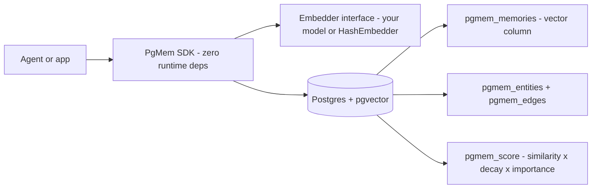

# pgmem

[English](README.md) | [中文](README.zh.md) | [日本語](README.ja.md)

 [](LICENSE) [](CHANGELOG.md) [](https://github.com/JaydenCJ/pgmem/discussions)

**开源的 agent 记忆引擎，跑在纯 Postgres 上：向量检索、知识图谱、时间衰减排序，零新增基础设施。**


```bash
npm install pgmem @electric-sql/pglite @electric-sql/pglite-pgvector
```

## 为什么是 pgmem？

给 agent 做长期记忆，今天要么交给 SaaS，要么接受妥协：Mem0 的开源版只覆盖向量层，图记忆锁在付费档；Zep 的平台已不再提供完全开源的自托管（只有其抽取库 Graphiti 保持开源）；Letta 则是一个需要单独运维的 server。对受数据主权约束的团队——EU AI Act 场景、日本的金融与医疗行业——让 agent 记忆离开自己的数据库根本不可接受。pgmem 把这层栈倒了过来：你已经在运行的 Postgres **就是**记忆引擎——pgvector 做相似度，普通数据表做知识图谱，两个可审计的 SQL 函数做时间衰减排序。

|  | pgmem | Mem0 | Zep |
|---|---|---|---|
| 图记忆 | MIT, included | Paid tier | Graphiti library + separate graph DB |
| 完全开源可自托管 | Yes — any Postgres with pgvector | Vector layer only | Platform is SaaS (from ~$25/mo) |
| 额外基础设施 | None | Vector store + LLM provider | Graph DB (e.g. Neo4j) |
| 写入路径的 LLM 调用 | None (deterministic) | Yes (fact extraction) | Yes (entity extraction) |

## 特性

- **零新增基础设施** —— 你已经在运行的 Postgres 就是整个记忆层，不用再部署、运维或付费给任何其它组件。
- **图记忆不设付费墙** —— 实体、带类型带权重的边、N 跳子图检索，全部 MIT。
- **时间感知检索** —— `pgmem_score` 按余弦相似度 x 指数级近因衰减 x 重要度排序，半衰期是逐查询参数。
- **embedding 由你注入** —— 只有两个成员的 `Embedder` 接口，不捆绑模型、不下载任何权重；内置确定性的 `HashEmbedder` 供测试与演示。
- **零运行时依赖** —— SDK 通过结构化的 `query()` 接口对接 `pg` 或 PGlite，解包后不到 70 kB。
- **多 agent namespace** —— 记忆、实体与边在同一个数据库内按 namespace 隔离。

## 快速开始

安装（下面零配置演示用到两个 PGlite 包；对接真实 Postgres 服务器时只需要 `pgmem` 与 `pg`）：

```bash
npm install pgmem @electric-sql/pglite @electric-sql/pglite-pgvector
```

保存为 `quickstart.mts` —— 一个带 pgvector 的真 Postgres 会直接跑在你的进程里：

```ts
import { PGlite } from "@electric-sql/pglite";
import { vector } from "@electric-sql/pglite-pgvector";
import { HashEmbedder, PgMem } from "pgmem";

const mem = new PgMem(new PGlite({ extensions: { vector } }), { embedder: new HashEmbedder(256) });
await mem.migrate();
await mem.add("Mika prefers oat-milk lattes in the morning", { entities: [{ name: "Mika", kind: "person" }] });
await mem.add("The deploy pipeline runs on port 8443 behind nginx");
const [top] = await mem.search("what does Mika drink in the morning?");
console.log(top?.content, `(score ${top?.score.toFixed(3)})`);
```

运行（Node 22+ 原生支持直接执行 TypeScript）：

```bash
node quickstart.mts
```

输出：

```text
Mika prefers oat-milk lattes in the morning (score 0.471)
```

### 对接 Postgres 服务器

```bash
cp .env.example .env   # set a strong POSTGRES_PASSWORD first
docker compose up -d   # pgvector/pgvector:pg16, bound to 127.0.0.1
```

```ts
import pg from "pg";
import { HashEmbedder, PgMem } from "pgmem";

const pool = new pg.Pool({ connectionString: process.env.DATABASE_URL });
const mem = new PgMem(pool, { embedder: new HashEmbedder(256) });
await mem.migrate();
```

偏好裸 SQL？schema 与排序函数就是普通文件——改好向量维度后执行：

```bash
psql "$DATABASE_URL" -f sql/001_schema.sql -f sql/002_functions.sql
```

### 接入你自己的 embedder

pgmem 不捆绑、不下载任何模型，自身也从不发起网络请求。任何 embeddings API 或本地模型几行代码就能变成一个 `Embedder`（示例仅作说明，凭证请自备）：

```ts
import type { Embedder } from "pgmem";

export const apiEmbedder: Embedder = {
  dimensions: 1536,
  async embed(texts) {
    const res = await fetch(`${process.env.OPENAI_BASE_URL ?? "https://api.openai.com/v1"}/embeddings`, {
      method: "POST",
      headers: { "content-type": "application/json", authorization: `Bearer ${process.env.OPENAI_API_KEY}` },
      body: JSON.stringify({ model: "text-embedding-3-small", input: texts }),
    });
    if (!res.ok) throw new Error(`embeddings API returned ${res.status}`);
    const json = (await res.json()) as { data: Array<{ embedding: number[] }> };
    return json.data.map((d) => d.embedding);
  },
};
```

## 架构



检索分两阶段：pgvector 的 HNSW 索引先收窄到 `limit x oversample` 个最近候选，再由 SQL 函数 `pgmem_score` 按 `similarity x 2^(-age / half_life) x importance` 重排。被 `search()` 返回的记忆会刷新 `last_accessed_at`，因此常被用到的知识能扛过 `decay()` 的修剪，而过期琐事逐渐淡出——两条 SQL 语句实现强化与遗忘。一切都运行在 Postgres 14+ 与 pgvector 0.5+ 之内；SDK 兼容任何暴露 `query(sql, params)` 的客户端，包括 `pg` 与 PGlite。

## 路线图

- [x] v0.1.0 —— 纯 Postgres 内的向量 + 图 + 时间衰减，零依赖 TypeScript SDK
- [ ] 混合检索：`tsvector` 关键词检索与向量排序结合
- [ ] 批量 `add()` 与批量导入辅助工具
- [ ] 对 Mem0 与 Zep 的可复现召回/延迟基准测试
- [ ] 共享同一 schema 与 SQL 函数的 Python SDK

完整列表见 [open issues](https://github.com/JaydenCJ/pgmem/issues)。

## 参与贡献

欢迎贡献——先读 [CONTRIBUTING.md](CONTRIBUTING.md)，然后从 [good first issue](https://github.com/JaydenCJ/pgmem/issues?q=is%3Aissue+is%3Aopen+label%3A%22good+first+issue%22) 入手，或到 [Discussions](https://github.com/JaydenCJ/pgmem/discussions) 发起讨论。

## 许可证

[MIT](LICENSE)
